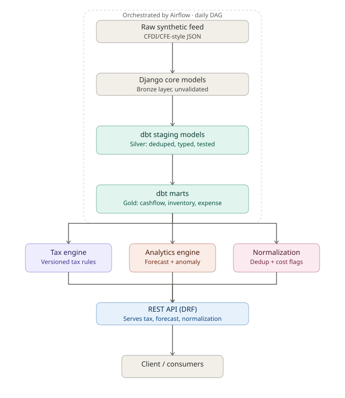
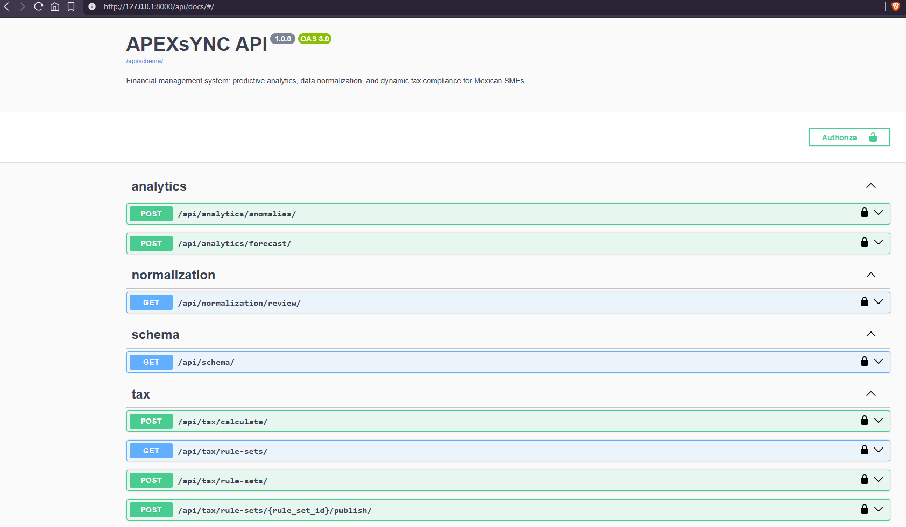

# APEXsYNC

A financial management system for Mexican SMEs, built as a dual data engineering / software engineering portfolio project. It combines a medallion-architecture data pipeline (ingestion → Bronze → Silver → Gold, orchestrated with Airflow and transformed with dbt) with a Django REST API layer exposing predictive analytics, data normalization, and a versioned, hot-swappable tax compliance engine.

It deliberately avoids the complexity of a traditional ERP like SAP: no monolithic configuration layer, no proprietary rules language. Tax rules are versioned data, not code, and every module reads from a tested, documented layer rather than raw transactional tables.

## Architecture



Data flows one direction, top to bottom: a raw synthetic feed (structured like real CFDI/CFE fiscal records, values fabricated) lands in Django-managed Bronze tables, gets transformed and tested through dbt into Silver (deduped, typed) and Gold (aggregated marts), then fans out to three engines that never touch raw data directly. All three converge into a single DRF API layer. Ingestion and transformation run on a daily Airflow DAG; tax rule updates run on a separate monthly DAG with a human-approval gate (not pictured - see [Design Decisions](#design-decisions)).

## Live API documentation

Auto-generated via `drf-spectacular`, browsable at `/api/docs/` once the server is running:



## Why this exists

Three requirements shaped every decision here:

1. **Predictive analytics** on inventory and cash flow data, identifying waste ("muda") - implemented as Prophet-based forecasting plus isolation-forest anomaly detection, reading only from tested Gold-layer marts.
2. **Data normalization** - duplicate detection, cost-spike flagging, and profitability signals, implemented as tested SQL in dbt rather than ad hoc Python, so the logic is versioned and auditable the same way the rest of the pipeline is.
3. **Dynamic tax compliance** - IVA and ISR calculations that can be updated monthly (per SHCP/Gaceta Oficial publications) without redeploying any code. This is the project's core architectural bet, detailed below.

## Design decisions

**Tax rules are versioned data, not code.** A `TaxRuleSet` moves through `draft → active → superseded`. The API layer resolves whichever rule set is `active` as of a given date with a single indexed lookup (`tax_engine.get_active_rule_set()`) and never touches anything else - no redeploy, no code change, no restart. Publishing a new rule set is a single atomic transaction that supersedes the previous one. This is deliberately over-engineered relative to what a single-tenant hobby project strictly needs, because it's the one part of the system where "the calculation was right as of the date it ran" is a real compliance requirement, not a nice-to-have.

**Tax rule updates go through a human, by design.** SHCP and the Gaceta Oficial don't expose a clean, scrapeable API for rate changes. Rather than pretend otherwise, the monthly Airflow DAG creates a `draft` rule set and pauses on a sensor until a human confirms the rates against the actual publication - then publishes automatically. The bottleneck is intentional.

**The analytics engine never sees raw transactional data.** Forecasting and anomaly detection read exclusively from dbt's Gold marts (`mart_monthly_cashflow`, `mart_inventory_turnover`), which are deduped, typed, and covered by dbt tests. This means a bad duplicate or a malformed record can't silently bias a forecast - it gets caught upstream, in a layer with its own test suite, before the model ever sees it.

**Duplicate detection lives in SQL, not Python.** `stg_transactions_deduped.sql` flags likely duplicates via a window function over account/amount/date - a transformation, tested like any other dbt model, rather than logic buried in an API view.

**Airflow and the Django/dbt stack run in separate virtual environments.** Airflow's dependency pinning collides with dbt-core's in a shared environment (both pin the templating/CLI stack tightly). Rather than fight the resolver, orchestration lives in its own venv and calls into the app environment via subprocess (for `manage.py`/`dbt`) or HTTP (for the tax rule publish flow) - the same boundary a production Airflow deployment would have with its worker environments.

**Synthetic data is structurally realistic, not real.** The data generator (`data_pipeline/synthetic_data/`) mimics CFDI/CFE field conventions - RFCs, folios, UUIDs, conceptos - so the pipeline exercises realistic shapes and edge cases (including a controlled ~4% injected duplicate rate for the normalization module to catch). No real entities, RFCs, or financial data are represented anywhere in this repo.

## Data engineering vs software engineering - what's where

| Layer | Contribution | Location |
|---|---|---|
| Data engineering | Synthetic data generation, medallion pipeline (Bronze/Silver/Gold), dbt models + tests, Airflow orchestration (3 DAGs) | `data_pipeline/` |
| Software engineering | Django/DRF API, versioned tax rules engine, forecasting/anomaly services, auth, OpenAPI docs | `backend/` |

Both halves are meant to stand alone. 

## Stack

- **Backend**: Django, Django REST Framework, drf-spectacular
- **Data pipeline**: dbt (Postgres adapter), Airflow 2.9
- **Analytics**: Prophet (forecasting), scikit-learn (isolation forest anomaly detection)
- **Data quality**: rapidfuzz (fuzzy dedup), dbt tests
- **Storage**: PostgreSQL

## Repo structure

```
apexsync/
├── data_pipeline/
│   ├── airflow/dags/        # daily_pipeline, monthly_tax_rule_update, forecast_refresh
│   ├── dbt_project/         # staging (Silver) + marts (Gold) models and tests
│   └── synthetic_data/      # CFDI/CFE-style raw feed generator
├── backend/
│   ├── core/                 # entities, accounts, transactions, inventory, cash flow
│   ├── tax_engine/           # versioned rule sets, bracket calculator, publish workflow
│   ├── analytics_engine/     # forecasting + anomaly detection
│   ├── normalization/        # dedup + profitability review
│   └── api/                  # DRF views, serializers, routing
└── docs/images/               # README assets
```

## API endpoints

| Method | Endpoint | Purpose |
|---|---|---|
| `POST` | `/api/tax/calculate/` | Calculate IVA/ISR against the active rule set |
| `GET`/`POST` | `/api/tax/rule-sets/` | List rule sets / create a draft |
| `POST` | `/api/tax/rule-sets/{id}/publish/` | Activate a draft rule set |
| `POST` | `/api/analytics/forecast/` | 6-month cash flow forecast (Prophet) |
| `POST` | `/api/analytics/anomalies/` | Cash flow + inventory anomaly flags |
| `GET` | `/api/normalization/review/` | Likely duplicates + cost-spike flags for human review |

Full interactive docs at `/api/docs/` once running.

## Running it

```bash
# App environment
python -m venv venv && source venv/bin/activate
pip install -r requirements.txt
python manage.py migrate
python manage.py seed_2026_rules
python manage.py load_synthetic_data
python manage.py runserver

# dbt (same venv)
cd data_pipeline/dbt_project && dbt run && dbt test

# Airflow (separate venv - see Design Decisions)
python -m venv airflow_venv && source airflow_venv/bin/activate
pip install "apache-airflow==2.9.3" --constraint <constraints-url>
airflow db migrate && airflow webserver --port 8080 & airflow scheduler &
```

## Scope notes

This implements the **monthly personas físicas** ISR tariff (Art. 96 LISR) and the general 16% IVA rate - not the annual tariff, personas morales (flat 30%), or RESICO's separate reduced-rate schedule. That's a deliberate scoping choice for this project; the versioned rule-set architecture supports adding those variants without any structural change.
